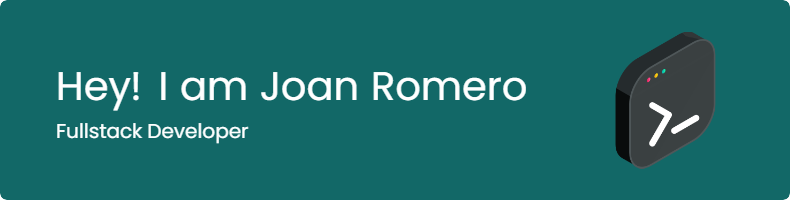

 

- 🔭 I’m currently working on [Time Killer](https://github.com/JoanR99/time-killer)

- 🌱 I’m currently learning **Docker and Django**

- 👨‍💻 All of my projects are available at [Portfolio](https://portfolio-joan-romero.vercel.app/)

- 💬 Ask me about **React, Express**

- 📫 How to reach me **romerojoan1999@gmail.com**

<h3 align="left">Connect with me:</h3>

